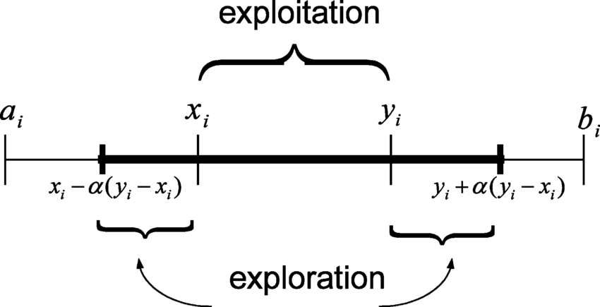

# Especificação 'Função Ackley'

## Projeto
Desenvolvimento de um Algoritmo Evolucionário (Estratégia Evolutiva) para a determinação do ponto de mínimo global da função de Ackley, definida por:

- Considere n = 30 e -15 ≤ xi ≤ 15.

Cada equipe, de no máximo de 3 integrantes, deverá implementar um Algoritmo
Evolutivo (Estratégia Evolutiva) em qualquer linguagem de programação. 

## Relatório
Além da implementação, a equipe deverá gerar um relatório descrevendo a sua implementação, dando ênfase nos tópicos:
1) Descrição esquemática do algoritmo implementado;
2) Descrição dos processos de:
    - Representação das soluções (indivíduos)
    - Função de Fitness
    - População (tamanho, inicialização, etc)
    - Processo de seleção
    - Operadores Genéticos (Recombinação e Mutação)
    - Processo de seleção por sobrevivência
    - Condições de término do Algoritmo Evolucionário
3) Descrição dos resultados experimentais

*** Compare com uma modificação da própria Estratégia Evolutiva, ou com um Algoritmo Genérico (Real)

## Especificação definida pelo grupo
- Representação (Indivíduo): Um array de 30 números reais
- Função de Fitness: 1 / (1 + função de Ackley no indivíduo)
- População:
    - Tamanho: 100
    - Inicialização:
        - Números reais aleatórios entre -15 e 15
        - Sem repetição
- Processo de seleção: 
    - Sobrevivência dos mais fortes entre pais e filhos (método Thanos)
- Operadores genéticos:
    - Recombinação: Cruzamento Intermediário
    - Mutação: Mutação Não Uniforme
- Condições de término: 10000 gerações ou fitness = 1

## Métodos implementados
### Seleção
- Melhores pais / Piores indivíduos
    - Ordena a população inteira em ordem de fitness
    - Pega os 2 pais com melhores fitness
    - Gera 2 filhos
    - Substitui os 2 piores indivíduos

- "Thanos"
    - Pega a população inteira par a par aleatoriamente:
        - Mais apto sobrevive
        - Menos apto morre
    - Gera filhos com a metade da população que sobreviveu até completar a população novamente

- 100% Elitista
    - Gera o número da população de filhos usando pais aleatorios (par a par)
    - Ordena a população baseado no fitness
    - Pega os 100 melhores individuos e descarta os 100 piores

### Cruzamento
- Cruzamento Discreto
    - Cada Xi do filho é uma média aritmética dos Xi(s) dos pais

- Cruzamento Intermediário
    - Cada Xi do filho é uma média ponderada dos Xi(s) dos pais. A ponderação é baseada no fitness dos pais

- Cruzamento BLX (Blend):
    - Cada Xi do filho é um número aleatório com mínimo e máximo baseado nos pais (vide imagem abaixo)
    - O α é o passo de mutação e varia entre 0-1 (geralmente na casa dos 0.15):
    

### Mutação
- Mutação Uniforme
    - O novo X é um novo número aleatório que varia entre LIM_MIN e LIM_MAX (no caso, de -15 a 15)

- Mutação Não Uniforme
    - O novo X é um novo número aleatório que varia entre X - desvio padrão e X + desvio padrão, onde o desvio padrão é o desvio do próprio indivíduo

- Mutação Gaussiana
    - O novo X é o próprio X acrescido de um dX provindo de uma distribuição gaussiana

- Mutação BLX
    - Semelhante ao cruzamento BLX, o novo X varia entre:
        - X - (passo * Range)
        - X + (passo * Range)
    - Onde esse passo é:
        - PassoBlx * 1/(fitnessIndividuo*PesoFitness)
    - O passo BLX é igual ao α do cruzamento BLX (varia entre 0 - 1)
    - O peso do fitness é o quanto o fitness influenciaria na mutação, que faz com que:
        - Indivíduos com fitness baixos escolham um número novo com um range grande, fugindo do lugar onde estão
        - Indivíduos com fitness altos escolham um número novo com um range pequeno, mantendo a direção que estão seguindo