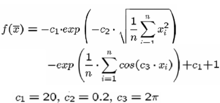

# Especificação 'Função Ackley'

## Projeto
Desenvolvimento de um Algoritmo Evolucionário (Estratégia Evolutiva) para a determinação do ponto de mínimo global da função de Ackley, definida por:

- Considere n = 30 e -15 ≤ xi ≤ 15.

Cada equipe, de no máximo de 3 integrantes, deverá implementar um Algoritmo
Evolutivo (Estratégia Evolutiva) em qualquer linguagem de programação. 

## Relatório
Além da implementação, a equipe deverá gerar um relatório descrevendo a sua implementação, dando ênfase nos tópicos:
1) Descrição esquemática do algoritmo implementado;
2) Descrição dos processos de:
    - Representação das soluções (indivíduos)
    - Função de Fitness
    - População (tamanho, inicialização, etc)
    - Processo de seleção
    - Operadores Genéticos (Recombinação e Mutação)
    - Processo de seleção por sobrevivência
    - Condições de término do Algoritmo Evolucionário
3) Descrição dos resultados experimentais

*** Compare com uma modificação da própria Estratégia Evolutiva, ou com um Algoritmo Genérico (Real)

## Especificação definida pelo grupo
- Representação (Indivíduo): Número real
- Função de Fitness: 1 / (1 + função de Ackley no indivíduo)
- População:
    - Tamanho: 100
    - Inicialização:
        - Números reais aleatórios entre -15 e 15
        - Sem repetição
- Processo de seleção: 
    - Sobrevivência dos mais fortes entre pais e filhos (método Thanos)
- Operadores genéticos:
    - Recombinação: Edge recombination
    - Mutação: incrementação ou decrementação
- Condições de término: 1000 gerações (assumindo que a gente não conhece a resposta)